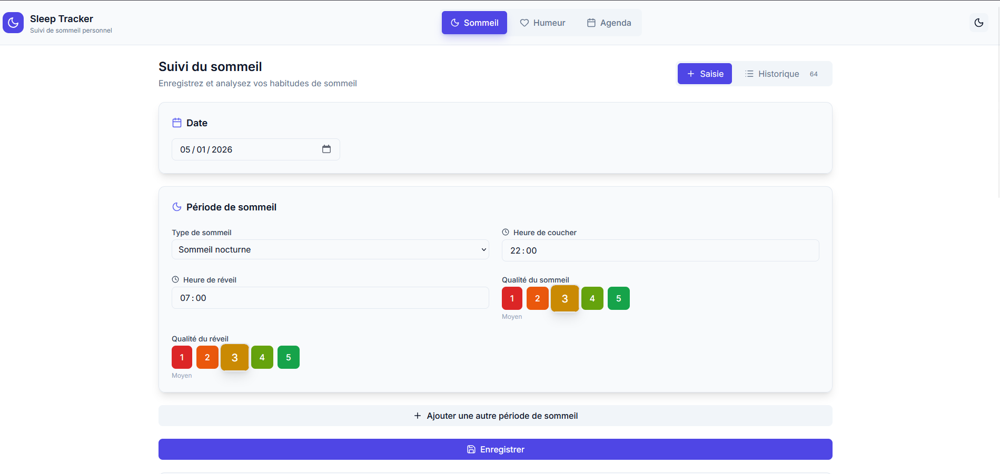
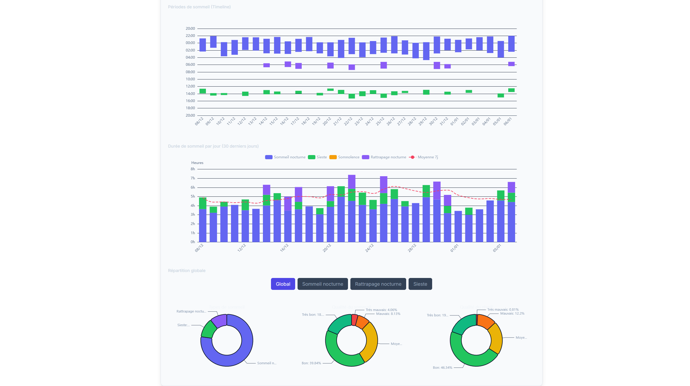
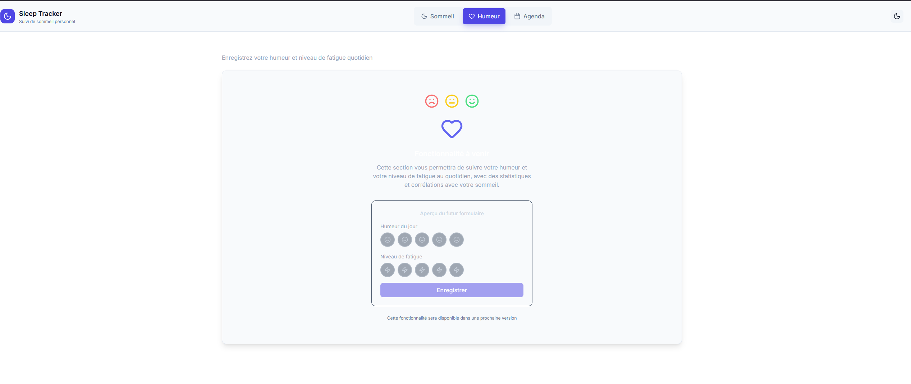
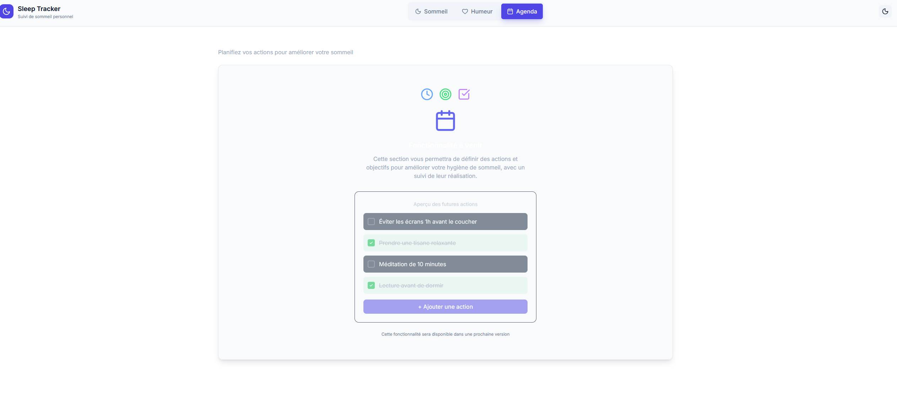

# Sleep Tracker

Application Electron de suivi de sommeil personnel et de soutien aux changement d'habitudes en vue d'amélioration du sommeil avec stockage 100% local et chiffré.

## 🎯 Caractéristiques
- **Santé Publique - Prévention** : Apporter de la connaissance au public
- **Approche Centré Patient** : La personne decide des actions a mettre en place ou non, de partager ces informations...
- **Privacy-first** : Controle utilisateur complet des données. Toutes les données sont stockées localement et chiffrées (AES-256)
- **Open-source** : Code source disponible projet ouvert aux contributions
- **Gratuit** : Aucun abonnement ni publicité
- **Multi-plateforme** : Windows, macOS et Linux
- **Approche Modulaire** : Faciliter le developpement d'autre module (Activité physique adaptée / reseaux sociaux...)
- **Partage médical** : Possibilité de stocker ces données chiffrées sur un serveur pour visualisation médical avec clé patient
- **Exportation** : exportation pdf / choix des graphiques
- **Evolution** : Version mobile
## 📸 Captures d'écran

<p align="center">
  <a href="./img/sleep_save.png">
    
  </a>
  <a href="./img/sleep_stat.png">
    
  </a>
</p>

<p align="center">
  <a href="./img/humeur.png">
    
  </a>
  <a href="./img/agenda.png">
    
  </a>
</p>

## ✨ Fonctionnalités

### 🌙 Sommeil (Complet)

**Saisie de données**
- Multiples périodes de sommeil par jour
- Types de sommeil : nocturne, sieste, somnolence, rattrapage
- Horaires de coucher et réveil
- Qualité du sommeil et du réveil (échelle 1-5)
- Calcul automatique de la durée
- Édition et suppression des entrées
- Logique de "date de nuit" (20h-20h) pour sommeil nocturne

**Visualisations et statistiques**
- **Timeline Gantt** : Barres verticales des périodes de sommeil sur 30 jours
- **Scatter Chart** : Points de coucher/réveil avec échelle 20h-20h
- **Stacked Bar Chart** : Durées cumulées par type + moyenne mobile 7 jours
- **Pie Charts interactifs** : 
  - Filtres par type (Global / Nocturne / Rattrapage / Sieste)
  - Répartition par type de sommeil
  - Distribution qualité sommeil et réveil

**Affichage**
- Historique groupé par nuit
- Vue Liste avec expand/collapse
- Badges colorés par type
- Tri et navigation faciles

### 🎨 Interface

- **Thème Dark/Light** : Toggle avec persistance
- Design moderne et épuré
- Responsive et animations fluides
- Navigation par onglets (Sommeil / Humeur / Agenda)

### 😊 Humeur (À venir)
- Suivi de l'humeur quotidienne
- Niveau de fatigue
- Corrélations avec le sommeil

### 📅 Agenda (À venir)
- Actions pour améliorer le sommeil
- Suivi des objectifs
- Rappels personnalisables

## 🚀 Installation

```bash
# Cloner le projet
git clone https://github.com/votre-repo/sleep-tracker.git
cd sleep-tracker

# Installer les dépendances
npm install

# Lancer en mode développement
npm run dev:electron
```

## 📜 Scripts disponibles

| Commande | Description |
|----------|-------------|
| `npm run dev` | Démarre le serveur de développement Vite |
| `npm run dev:electron` | Lance Vite + Electron en développement |
| `npm run build` | Build de production (React) |
| `npm run build:electron` | Build complet pour Electron |
| `npm run test` | Lance les tests en mode watch |
| `npm run test:run` | Lance les tests une fois |
| `npm run lint` | Vérifie le code avec ESLint |
| `npm run format` | Formate le code avec Prettier |
| `npm run dist:win` | Build l'exécutable Windows |
| `npm run dist:mac` | Build l'exécutable macOS |
| `npm run dist:linux` | Build l'exécutable Linux |

## 🛠️ Stack Technique

- **Frontend** : React 19, TypeScript
- **Desktop** : Electron
- **Build** : Vite
- **Styling** : Tailwind CSS
- **Graphiques** : Apache ECharts (echarts-for-react)
- **Icônes** : Lucide React
- **Stockage** : electron-store avec chiffrement AES-256
- **Tests** : Vitest + Testing Library
- **CI/CD** : GitHub Actions (à configurer)

## 📁 Structure du projet

```
src/
├── main/              # Process principal Electron
│   ├── index.ts       # Point d'entrée Electron
│   └── store.ts       # Stockage chiffré
├── preload/           # Bridge IPC sécurisé
│   └── index.ts
└── renderer/          # Application React
    ├── components/    # Composants UI
    │   ├── layout/    # Layout, Navigation
    │   ├── sleep/     # Composants sommeil
    │   │   └── charts/  # Graphiques (Timeline, Scatter, Stacked, Pie)
    │   ├── mood/      # Placeholder humeur
    │   └── agenda/    # Placeholder agenda
    ├── contexts/      # Context React (Theme)
    ├── hooks/         # Hooks personnalisés (useSleepData)
    ├── types/         # Types TypeScript
    ├── utils/         # Fonctions utilitaires
    │   ├── dateUtils.ts        # Calculs dates/durées
    │   └── generateTestData.ts # Génération données test
    └── styles/        # Styles globaux + variables CSS
```

## 🔧 Développement

### Générer des données de test

Ouvrez la console du navigateur (F12) et exécutez :

```javascript
// Générer 30 jours de données aléatoires
await insertTestData(30)

// Effacer toutes les données
await clearAllData()
```

### Architecture des données

Les entrées de sommeil suivent cette structure :

```typescript
interface SleepEntry {
  id: string
  date: string              // Format YYYY-MM-DD
  sleepType: 'nocturne' | 'sieste' | 'somnolence' | 'rattrapage'
  bedTime: string           // Format HH:mm
  wakeTime: string          // Format HH:mm
  sleepQuality: 1 | 2 | 3 | 4 | 5
  wakeQuality: 1 | 2 | 3 | 4 | 5
  createdAt: string
  updatedAt: string
}
```

## 🔒 Sécurité

- Les données sont chiffrées avec **AES-256-GCM**
- La clé de chiffrement est dérivée de l'ID machine
- **Aucune donnée n'est envoyée à l'extérieur**
- Context isolation activé dans Electron
- nodeIntegration désactivé
- IPC avec whitelist de canaux autorisés

## 🧪 Tests

```bash
# Lancer les tests
npm run test

# Lancer les tests avec couverture
npm run test:coverage

# Tests en mode watch
npm run test:watch
```

Tests unitaires disponibles pour :
- Utilitaires de dates (`dateUtils.test.ts`)
- Plus de tests à ajouter

## 📝 Roadmap

- [x] Saisie multiple de périodes de sommeil
- [x] 4 types de graphiques interactifs
- [x] Thème Dark/Light
- [x] Logique de date de nuit (20h-20h)
- [x] Système de filtrage des pie charts
- [ ] Module Humeur
- [ ] Module Agenda
- [ ] Export des données (CSV/JSON)
- [ ] Statistiques avancées
- [ ] Rappels et notifications
- [ ] CI/CD complet

## 🤝 Contribution

Les contributions sont les bienvenues ! N'hésitez pas à :
1. Fork le projet
2. Créer une branche (`git checkout -b feature/amelioration`)
3. Commit vos changements (`git commit -m 'Ajout fonctionnalité'`)
4. Push vers la branche (`git push origin feature/amelioration`)
5. Ouvrir une Pull Request

## 📄 Licence

MIT - Voir le fichier [LICENSE](LICENSE) pour plus de détails.

## 👤 Auteur

Projet POC développé dans le cadre d'une demande de subvention pour une application de monitoring de sommeil open-source et privacy-first.
